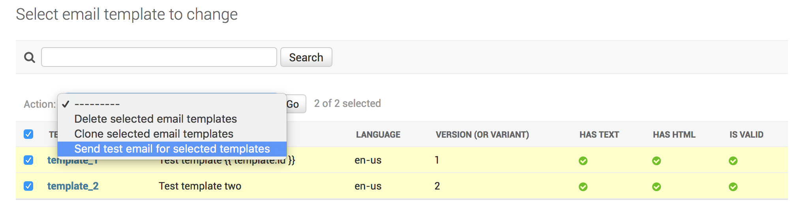
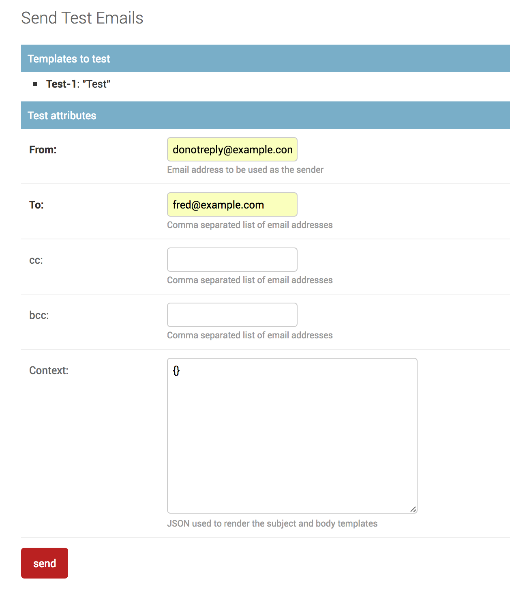
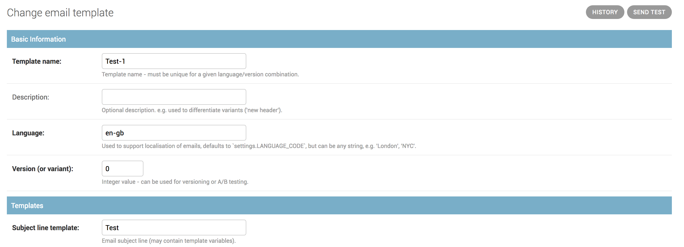

# Django-AppMail

[](https://pypi.org/project/django-appmail/)

Django app for managing transactional email templates.

## Compatibility

This project now requires Django 3.2+ and Python 3.8+. If you require a previous
version you will have to refer to the relevant branch or tag.

## Background

This project arose out of a project to integrate a large transactional Django
application with Mandrill, and the lessons learned. It also owes a minor h/t to
this project from 2011 (https://github.com/hugorodgerbrown/AppMail).

The core requirement is to provide an easy way to add / edit email templates to
a Django project, in such a way that it doesn't require a developer to make
changes. The easiest way to use templated emails in Django is to rely on the
in-built template structure, but that means that the templates are held in
files, under version control, which makes it very hard for non-developers to
edit.

This is **not** a WYSIWYG HTML editor, and it doesn't do anything clever. It
doesn't handle the sending of the emails - it simply provides a convenient
mechanism for storing and rendering email content.

```python
from appmail.models import EmailTemplate, AppmailMessage

def send_order_confirmation(order_id):
    order = Orders.objects.get(id=order_id)
    template = EmailTemplate.objects.current('order_confirmation')
    context = { "order": order }
    message = AppmailMessage(
        template=template,
        context=context,
        to=[order.recipient.email]
    )
    message.send()
```

The core requirements are:

1. List / preview existing templates
2. Edit subject line, plain text and HTML content
3. Use standard Django template syntax
4. Support base templates
5. Template versioning
6. Language support
7. Send test emails
8. Log emails sent (if desired)

### Email logging (v2)

From v2 on, it is possible to log all emails that are sent via
`AppmailMessage.send`. It records the template, context and the rendered output,
so that the email can be views as sent, and resent. It will attempt to record
the User to whom the email was sent, as well as the email address. This is
dependent on there being a unique 1:1 match from email to User object, but can
prove useful in tracking emails sent to users when they change their email
address.

### Template properties

Individual templates are stored as model objects in the database. The standard
Django admin site is used to view / filter templates. The templates are ordered
by name, language and version. This combination is unique. The language and
version properties have sensible defaults (`version=settings.LANGUAGE_CODE` and
`version=0`) so don't need to set if you don't require it. There is no
inheritance or relationship between different languages and versions - they are
stored as independent objects.

```python
# get the default order_summary email (language = settings.LANGUAGE_CODE)
template = EmailTemplate.objects.current('order_summary')
# get the french version
template = EmailTemplate.objects.current('order_summary', language='fr')
# get a specific version
template = EmailTemplate.objects.version('order_summary', 1)
```

**Template syntax**

The templates themselves use standard Django template syntax, including the use
of tags, filters. There is nothing special about them, however there is one
caveat - template inheritance.

**Template inheritance**

Although the template content is not stored on disk, without re-engineering the
template rendering methods any parent templates must be. This is annoying, but
there is a valid assumption behind it - if you are changing your base templates
you are probably involving designers and developers already, so having to rely
on a developer to make the changes is acceptable.

**Sending test emails**

You can send test emails to an email address through the admin list view.



The custom admin action 'Send test emails' will redirect to an intermediate page
where you can enter the recipient email address and send the email:



There is also a linkon individual template admin pages (top-right, next to the
history link):



## Tests

There is a test suite for the app, which is best run through `tox`.

## License

MIT

## Contributing

Usual rules apply:

1. Fork to your own account
2. Fix the issue / add the feature
3. Submit PR

Please take care to follow the coding style - and PEP8.
